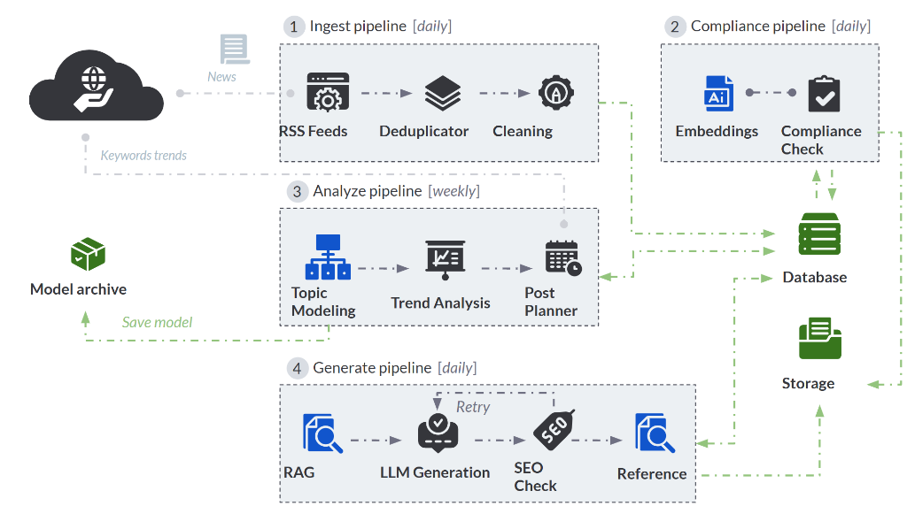

# Automating the Creation of 700 Blogs Monthly 🚀

An automated, AI-powered content generation pipeline designed to help a FinTech company scale content production while ensuring relevance, SEO optimization, and brand consistency with minimal human intervention.

---

## 🎯 The Challenge
A FinTech company needs to automatically generate **700 high-quality blog posts per month** (over 8,400 articles per year).

### Key Requirements:
* **Generate Relevant Content**: Automatically identify and write about fresh and engaging topics tailored to the market.
* **Optimize Articles for SEO**: Ensure search engine visibility and avoid duplicate content penalties.
* **Ensure Brand Consistency**: Align every article with corporate guidelines and corporate tone of voice.
* **Automate Publication**: Provide a seamless, automated workflow from news ingestion to ready-to-publish drafts.
* **Scale Efficiently**: Achieve high volume production with minimal human intervention.

---

## 🏗️ Design Approach & Architecture
Relying on a static, limited list of keywords at this scale carries a high risk of generating repetitive or low-value content. This would negatively impact user experience and SEO performance, as search engines penalize duplicate or low-value articles [[1]](https://developers.google.com/search/docs/specialty/international/duplicate-content).

To address this challenge, the solution adopts an **incremental design** that automatically harvests live FinTech news and market trends, using them as dynamic context. 

### Progressive Data Filtering Funnel
Data undergoes a progressive filtering and cleaning process before entering the analysis and generation pipelines to guarantee the highest data quality:



---

## ⚙️ Core Pipeline Blocks & Technologies

The system is organized into four main pipeline stages:

### 1. Ingest Pipeline (Daily)
* **Goal**: Collect, filter, and validate high-quality news from the web to keep content fresh at scale.
* **Key Components**:
  * **RSS Connector**: Automatically collects articles from multiple FinTech news sources (e.g., *TechCrunch*, *Finextra*, *Payments Dive*), extracts key metadata (title, summary, URL, source, publication date) and resolves Google News redirection URLs dynamically.
  * **Deduplicator**: Removes articles with duplicate URLs and is designed to be easily extended with other matching criteria (e.g., title or metadata similarity).
  * **Preprocessing & Data Cleaning**: Normalizes Unicode characters, strips HTML tags, standardizes text formatting, and normalizes publication dates into a consistent format.
* **Technologies**: `feedparser`, `beautifulsoup4`, `trafilatura`, `googlenewsdecoder`

### 2. Compliance Pipeline (Daily)
* **Goal**: Ensure absolute brand identity alignment and filter out inconsistent topics or competitor references.
* **Key Components**:
  * **Embedding Service**: A centralized service running SentenceTransformers (`all-MiniLM-L6-v2`) to generate vector representations of textual content. The model is loaded as a singleton to avoid redundant memory usage.
  * **Compliance Check**: Combines lexical rules (regex blacklists for competitors) with semantic similarity checks. Articles are compared against a brand identity profile using cosine similarity and classified based on a configurable threshold. Non-compliant articles are filtered out.
* **Technologies**: `sentence-transformers`, `scikit-learn`

### 3. Analyze Pipeline (Weekly)
* **Goal**: Transform market signals into content strategy by identifying topics, forecasting trends, and planning posts.
* **Key Components**:
  * **Topic Modeling**: Automatically groups compliant articles into unsupervised thematic clusters using `BERTopic` (incorporating `UMAP` for dimensionality reduction and `HDBSCAN` for clustering). The model is retrained weekly on a rolling window of articles from the last two weeks, then saved and reused for daily inference.
  * **Trend Feature Engineering**: Transforms classified articles into quantitative signals to evaluate topic relevance:
    * *Volume*: Number of articles associated with the topic.
    * *Freshness*: Temporal relevance of recent content.
    * *Source Diversity*: Distribution of the topic across different publisher sources.
  * **Trend Forecasting**: Fits an `XGBoost Regressor` dynamically on historical lag features to forecast future topic volumes. The model configuration is designed to balance the bias-variance tradeoff.
  * **Trend Scoring & Prioritization**: Topics are ranked according to a composite Trend Score:
    $$\text{TrendScore} = \text{PredictedVolume} \times (1 + \text{Freshness}) \times (1 + \text{SourceDiversity})$$
  * **Post Planner**: Computes an Effective Score:
    $$\text{EffectiveScore} = \text{TrendScore} \times \text{ComplianceRate}$$
    The daily post budget is allocated proportionally across topics using the *Largest Remainder Method* based on their Effective Score. Google Trends related queries are fetched to enrich the context for the active topics.
* **Technologies**: `bertopic`, `umap-learn`, `hdbscan`, `xgboost`, `pytrends`, `pandas`

### 4. Generate Pipeline (Daily)
* **Goal**: Generate context-aware, SEO-friendly, and original blog posts in Italian.
* **Key Components**:
  * **RAG (Retrieval-Augmented Generation)**: Builds an in-memory `FAISS` vector index dynamically using only compliant, unused articles related to the topic, retrieving the top 3 semantically relevant sources as LLM context.
  * **LLM Synthesis**: Queries `Gemini 1.5 Flash` using structured Jinja2 templates (defining model role, editorial tone, brand constraints, and SEO rules).
  * **SEO Check & Self-Correction**: Validates the draft based on word count, Markdown heading structures (H1/H2/H3), keyword presence, and density. If the SEO score is below a threshold, the pipeline automatically triggers a single regeneration attempt using corrective feedback. Articles that still fail are flagged for manual review. A semantic similarity check prevents duplicate posts.
  * **Referencing & Internal Linking**: Computes embeddings for the new post, queries a persistent FAISS index of previously published articles using cosine similarity, and appends the top 2 semantically closest links as recommended articles.
* **Technologies**: `google-genai` (Gemini 1.5 Flash API), `faiss-cpu`, `jinja2`, `scikit-learn`

---

## 🛠️ Additional Components

### Pipeline Orchestration (Prefect)
Workflow steps are structured as independent tasks coordinated by **Prefect**. Prefect organizes workflows into independent, scheduled tasks, handles execution monitoring, automatic retries for critical steps, centralized logging, and schedule deployments.
* **Default Schedules (Europe/Rome timezone)**:
  * **Daily Ingest & Compliance**: Runs daily at **01:00 AM** (`0 1 * * *`).
  * **Weekly Topic Analysis**: Runs every Monday at **02:00 AM** (`0 2 * * 1`).
  * **Daily Post Generation**: Runs daily at **06:00 AM** (`0 6 * * *`).

### Published Posts Semantic Index
Published articles are indexed with `FAISS` using their semantic embeddings to enable efficient retrieval of related content for internal linking. In production, this index is rebuilt periodically to balance content freshness with index reconstruction costs.

### Database and Data Organization
A structured SQLite database schema managed via SQLAlchemy ORM allows the system to easily scale and migrate to robust DBMSs (e.g. PostgreSQL) with minimal code changes.

| Table | Description | Key Fields |
| :--- | :--- | :--- |
| **`articles`** | Raw articles fetched from feed crawlers. | `id`, `title`, `summary`, `content`, `url`, `source`, `published`, `topic_id`, `embedding`, `is_compliant`, `is_used` |
| **`topics`** | Discovered cluster categories generated during topic modeling. | `id`, `topic_id` (BERTopic integer id), `label`, `keywords`, `is_active` |
| **`topic_trends`** | Calculated metrics and forecasted growth metrics. | `id`, `topic_id`, `volume`, `freshness_score`, `source_diversity`, `trend_score` |
| **`generation_plans`**| Daily content calendars allocating budget count and search trends. | `id`, `topic_id`, `allocated_posts`, `trend_score`, `keywords`, `search_trends` |
| **`generated_posts`** | Completed copy documents created by Gemini. | `id`, `topic_id`, `title`, `content`, `url`, `embedding`, `seo_score`, `max_similarity`, `needs_review`, `is_published` |

---

## 📁 Project Structure

```text
blog-generation-pipeline/
├── app/
│   ├── collectors/          # Data collection (RSS Feeds)
│   │   ├── base.py
│   │   └── rss.py
│   ├── compliance/          # Lexical & semantic compliance filtering
│   │   └── compliance_filter.py
│   ├── database/            # Database configurations, models, and repositories
│   │   ├── db.py            # SQLite connection & schema migrations
│   │   ├── models/          # SQLAlchemy schemas (articles, posts, topics, etc.)
│   │   └── repositories/    # Database abstraction layer for CRUD actions
│   ├── downloaders/         # Full-text content fetchers
│   │   └── article_downloader.py
│   ├── entities/            # Typed schemas & dataclasses
│   ├── generation/          # RAG, Post Planning, and LLM text generation
│   │   ├── generator.py     # Gemini & Mock generation pipelines
│   │   ├── planner.py       # Budget allocator & Google Trends crawler
│   │   ├── rag.py           # FAISS-based article retriever
│   │   └── templates/       # Jinja2 prompt templates for system & LLM prompts
│   ├── preprocessing/       # Article cleaning and deduplication utilities
│   │   ├── deduplicator.py
│   │   └── text_cleaner.py
│   ├── services/            # Global helpers (embedding models, SEO, Published indexer)
│   │   ├── embedding.py
│   │   ├── published_index.py
│   │   └── seo_checker.py
│   ├── topic_modeling/      # BERTopic wrapper and HTML visualizations
│   │   └── bertopic_model.py
│   ├── trend_analysis/      # XGBoost-based daily trend forecaster
│   │   └── scorer.py
│   └── pipeline.py          # Unified CLI subroutines and task mappings
├── data/                    # Generated files, DB file, and models (excluded from git)
│   ├── database.db          # SQLite relational database
│   ├── competitor_blacklist.txt
│   ├── brand_identity.txt
│   ├── models/              # Serialized BERTopic models
│   ├── posts/               # Final generated markdown articles
│   ├── visualizations/      # Interactive HTML topic plots
│   └── published_posts.index# FAISS vector index for cross-linking
├── config.py                # Main application settings & constants
├── flow.py                  # Prefect flows, task schedulers, and deployments
├── main.py                  # CLI entry point
├── requirements.txt         # Project dependencies
├── pipeline_flow.png        # Architecture diagram image
└── README.md                # Project documentation
```

---

## ⚙️ Configuration & Setup

### 1. Prerequisites
- Python 3.10+
- SQLite3

### 2. Installation
Clone the repository and set up a virtual environment:
```bash
git clone https://github.com/AlbertoMarinelli/blog-generation-pipeline.git
cd blog-generation-pipeline
python -m venv .venv
source .venv/bin/activate  # On Windows use: .venv\Scripts\activate
pip install -r requirements.txt
```

### 3. Environment Config
The application imports standard settings from `config.py`. Configure keys and parameters in a `.env` file in the project root:
```env
# Gemini API Configuration
GEMINI_MOCK_MODE=False     # Set to False to use the actual Gemini API
GEMINI_API_KEY=AIzaSy...   # Your Google AI Studio Gemini API Key

# Database configuration (defaults to local SQLite database.db)
DATABASE_URL=sqlite:///data/database.db
```

Ensure compliance profiles are initialized:
- Add competitor names (one per line) in `data/competitor_blacklist.txt`.
- Add your company profile description in `data/brand_identity.txt` (used to filter relevant topics).

---

## 🚀 Execution & Usage

### Running via CLI (`main.py`)
You can trigger individual components or run the entire sequence using the command-line interface:

* **Run all pipeline steps sequentially**:
  ```bash
  python main.py run-all
  ```
* **Harvest feed items and clean contents**:
  ```bash
  python main.py ingest
  ```
* **Verify brand compliance on pending articles**:
  ```bash
  python main.py compliance
  ```
* **Classify new articles into existing topics**:
  ```bash
  python main.py classify
  ```
* **Cluster articles, calculate trends, and plan posts**:
  ```bash
  python main.py analyze
  ```
* **Generate final blog posts using RAG and Gemini**:
  ```bash
  python main.py generate
  ```
* **Rebuild the published post vector index for recommendations**:
  ```bash
  python main.py build-index
  ```
* **Enable detailed debug logs**:
  Add `-v` or `--verbose` flag:
  ```bash
  python main.py -v run-all
  ```

---

## ⏰ Workflow Orchestration with Prefect (`flow.py`)

Run individual pipelines or start the scheduler:
* **Run Demo Flow (End-to-End Test)**:
  ```bash
  python flow.py demo
  ```
* **Run Daily Ingestion & Compliance Flow**:
  ```bash
  python flow.py daily-ingest
  ```
* **Run Weekly Topic Analysis Flow**:
  ```bash
  python flow.py weekly-analysis
  ```
* **Run Daily Post Generation Flow**:
  ```bash
  python flow.py daily-generate
  ```
* **Start Prefect Scheduler Server**:
  ```bash
  python flow.py serve
  ```

---

## 📊 Visualizations
The topic modeling stage automatically exports interactive Plotly figures in `data/visualizations/` whenever it runs:
- **`topic_similarity.html`**: Interactive multidimensional scaling plot mapping relative distances between discovered clusters.
- **`topic_barchart.html`**: Grouped keyword-frequency distributions for top clusters.
- **`topic_hierarchy.html`**: Dendrogram displaying hierarchical agglomerative grouping relationships of topics.

---

## 🔮 Future Developments & Improvements

* **Automatic Publishing Engine**:
  Extend the pipeline with a fully automated publishing module integrated with the company's CMS. After passing quality/SEO checks, generated articles would be published automatically, with the content status updated in the database and the blog deployment process triggered without manual intervention.
* **Performance Analytics Loop**:
  Introduce a feedback loop based on real blog performance metrics (e.g., page views, reading time, CTR, and bounce rate). These insights could be used to continuously improve content generation through dynamic prompt optimization and future trend selection by rewarding or penalizing topics according to their observed performance.
