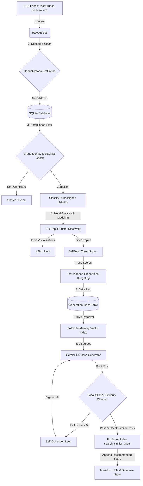

# Fintech Blog Generation Pipeline 🚀

An automated, AI-powered content generation pipeline designed for B2B Fintech blogs. The system harvests industry news from multiple RSS feeds, filters articles based on brand compliance, clusters news into emergent themes using topic modeling, predicts trend trajectories via machine learning, and generates high-quality, SEO-optimized blog posts in Italian using Retrieval-Augmented Generation (RAG) and Google Gemini models. The entire workflow is orchestrated using Prefect.

---

## 🏗️ Architecture & Pipeline Flow

The system runs as an end-to-end multi-stage pipeline, either sequentially on-demand or as scheduled Prefect tasks:



---

## ✨ Key Features

1. **Robust Ingestion & URL Decoding**: 
   Collects Fintech articles from custom feeds (`TechCrunch`, `Finextra`, `Payments Dive`). Resolves obscured Google News redirection URLs dynamically via `googlenewsdecoder` and extracts structured content using `trafilatura` and `BeautifulSoup4`.
2. **Semantic Brand Compliance**: 
   Screens downloaded articles using a double-layered approach:
   - **Lexical Blacklist**: Rejects articles mentioning competitors defined in `competitor_blacklist.txt`.
   - **Semantic Alignment**: Projects articles into vector space via SentenceTransformers (`all-MiniLM-L6-v2`) and verifies their cosine similarity against a brand identity manifesto (`brand_identity.txt`).
3. **Latent Topic Discovery (BERTopic)**: 
   Uses a rolling window of recent compliant articles to train a `BERTopic` model (incorporating `UMAP` for dimensionality reduction, `HDBSCAN` for clustering, and class-based TF-IDF for dynamic keyword generation). Generates interactive HTML visualization plots (similarity maps, keyword barcharts, and hierarchies).
4. **Predictive Trend Scoring (XGBoost)**: 
   Aggregates daily topic volumes and trains an `XGBoost Regressor` on historical lag values to forecast tomorrow's volume. It computes a composite **Trend Score** balancing forecasted volume, topic freshness (exponential time decay), and publisher source diversity.
5. **Fair-Share Post Planner**: 
   Allocates the daily post budget across topics using the *Largest Remainder Method* based on their active trend scores weighted by their brand compliance rate. Integrates Google Trends data (`pytrends`) to enrich the keyword set.
6. **RAG-Driven Article Synthesis (FAISS + Gemini)**: 
   Indexes topic-specific articles on-the-fly in an in-memory `FAISS` vector space, retrieves relevant context vectors, and queries `gemini-1.5-flash` using the official `google-genai` SDK and structured Jinja2 prompt templates to write detailed Italian articles.
7. **SEO Self-Correction Loop**: 
   Evaluates each generated draft across four dimensions: word count, heading structures (H1/H2/H3 validation), keyword presence, and keyword density. Re-submits the draft with specific corrective feedback if the SEO score drops below 60.
8. **Smart Cross-Linking Recommendation Engine**: 
   Maintains a persistent vector index (`data/published_posts.index`) of all published blog posts. Upon generating a new post, it queries this index to automatically append a "Recommended Articles" section containing semantic links to prior posts.

---

## 🛠️ Technology Stack

* **ML / NLP & Semantic Search**: `bertopic`, `sentence-transformers` (`all-MiniLM-L6-v2`), `faiss-cpu`, `umap-learn`, `hdbscan`, `scikit-learn`, `xgboost`
* **Workflow Orchestration**: `prefect` (flows, tasks, and cron schedules)
* **Large Language Models**: `google-genai` (Gemini 1.5 Flash API)
* **Database & Storage**: `sqlite` (with `SQLAlchemy` ORM) and `pandas`
* **Scraping & Parsing**: `feedparser`, `beautifulsoup4`, `trafilatura`, `googlenewsdecoder`
* **Templating**: `jinja2`

---

## 📁 Project Structure

```text
blog-generation-pipeline/
├── app/
│   ├── collectors/          # Data collection (RSS Feeds)
│   │   ├── base.py
│   │   └── rss.py
│   ├── compliance/          # Lexical & semantic compliance filtering
│   │   └── compliance_filter.py
│   ├── database/            # Database configurations, models, and repositories
│   │   ├── db.py            # SQLite connection & schema migrations
│   │   ├── models/          # SQLAlchemy schemas (articles, posts, topics, etc.)
│   │   └── repositories/    # Database abstraction layer for CRUD actions
│   ├── downloaders/         # Full-text content fetchers
│   │   └── article_downloader.py
│   ├── entities/            # Typed schemas & dataclasses
│   ├── generation/          # RAG, Post Planning, and LLM text generation
│   │   ├── generator.py     # Gemini & Mock generation pipelines
│   │   ├── planner.py       # Budget allocator & Google Trends crawler
│   │   ├── rag.py           # FAISS-based article retriever
│   │   └── templates/       # Jinja2 prompt templates for system & LLM prompts
│   ├── preprocessing/       # Article cleaning and deduplication utilities
│   │   ├── deduplicator.py
│   │   └── text_cleaner.py
│   ├── services/            # Global helpers (embedding models, SEO, Published indexer)
│   │   ├── embedding.py
│   │   ├── published_index.py
│   │   └── seo_checker.py
│   ├── topic_modeling/      # BERTopic wrapper and HTML visualizations
│   │   └── bertopic_model.py
│   ├── trend_analysis/      # XGBoost-based daily trend forecaster
│   │   └── scorer.py
│   └── pipeline.py          # Unified CLI subroutines and task mappings
├── data/                    # Generated files, DB file, and models (excluded from git)
│   ├── database.db          # SQLite relational database
│   ├── competitor_blacklist.txt
│   ├── brand_identity.txt
│   ├── models/              # Serialized BERTopic models
│   ├── posts/               # Final generated markdown articles
│   ├── visualizations/      # Interactive HTML topic plots
│   └── published_posts.index# FAISS vector index for cross-linking
├── config.py                # Main application settings & constants
├── flow.py                  # Prefect flows, task schedulers, and deployments
├── main.py                  # CLI entry point
├── requirements.txt         # Project dependencies
└── README.md                # Project documentation
```

---

## ⚙️ Configuration & Setup

### 1. Prerequisites
- Python 3.10+
- SQLite3

### 2. Installation
Clone the repository and set up a virtual environment:
```bash
git clone https://github.com/your-username/blog-generation-pipeline.git
cd blog-generation-pipeline
python -m venv .venv
source .venv/bin/activate  # On Windows use: .venv\Scripts\activate
pip install -r requirements.txt
```

### 3. Environment Config
The application imports standard settings from `config.py`. To configure keys and parameters, define the following variables in a `.env` file or in your environment:
```env
# Gemini API Configuration
GEMINI_MOCK_MODE=False     # Set to False to use the actual Gemini API
GEMINI_API_KEY=AIzaSy...   # Your Google AI Studio Gemini API Key

# Database configuration (defaults to local SQLite database.db)
DATABASE_URL=sqlite:///data/database.db
```

Ensure you have initialized the compliance filters:
- Add competitor names (one per line) in `data/competitor_blacklist.txt`.
- Add your company profile description in `data/brand_identity.txt` (used to filter relevant topics).

---

## 🚀 Execution & Usage

### Running via CLI (`main.py`)
You can trigger individual components or run the entire sequence using the command-line interface:

* **Run all pipeline steps sequentially (Ingest, Compliance, Analyze, Generate)**:
  ```bash
  python main.py run-all
  ```
* **Harvest feed items and clean contents**:
  ```bash
  python main.py ingest
  ```
* **Verify brand compliance on pending articles**:
  ```bash
  python main.py compliance
  ```
* **Classify new articles into existing topics**:
  ```bash
  python main.py classify
  ```
* **Cluster articles, calculate trends, and plan posts**:
  ```bash
  python main.py analyze
  ```
* **Generate final blog posts using RAG and Gemini**:
  ```bash
  python main.py generate
  ```
* **Rebuild the published post vector index for recommendations**:
  ```bash
  python main.py build-index
  ```
* **Enable detailed debug logs**:
  Add `-v` or `--verbose` flag:
  ```bash
  python main.py -v run-all
  ```

---

## ⏰ Workflow Orchestration with Prefect (`flow.py`)

For production, the workflows are structured into distinct Prefect flows. You can run individual pipelines or start the scheduler to run on standard schedules:

### Commands
* **Run Demo Flow (End-to-End Test)**:
  ```bash
  python flow.py demo
  ```
* **Run Daily Ingestion & Compliance Flow**:
  ```bash
  python flow.py daily-ingest
  ```
* **Run Weekly Topic Analysis Flow**:
  ```bash
  python flow.py weekly-analysis
  ```
* **Run Daily Post Generation Flow**:
  ```bash
  python flow.py daily-generate
  ```
* **Start Prefect Scheduler Server**:
  Starts the orchestration agent serving three scheduled deployments configured with Cron expressions:
  ```bash
  python flow.py serve
  ```

### Default Schedules (Europe/Rome timezone)
1. **Daily Ingest & Compliance**: Runs every day at **01:00 AM** (`0 1 * * *`).
2. **Weekly Topic Analysis**: Runs every Monday at **02:00 AM** (`0 2 * * 1`).
3. **Daily Post Generation**: Runs every day at **06:00 AM** (`0 6 * * *`).

---

## 📊 Database Schema Details

The SQLite schema consists of the following primary tables managed via SQLAlchemy:

| Table | Description | Key Fields |
| :--- | :--- | :--- |
| **`articles`** | Raw articles fetched from feed crawlers. | `id`, `title`, `summary`, `content`, `url`, `source`, `published`, `topic_id`, `embedding`, `is_compliant`, `is_used` |
| **`topics`** | Discovered cluster categories generated during topic modeling. | `id`, `topic_id` (BERTopic integer id), `label`, `keywords`, `is_active` |
| **`topic_trends`** | Calculated metrics and forecasted growth metrics. | `id`, `topic_id`, `volume`, `freshness_score`, `source_diversity`, `trend_score` |
| **`generation_plans`**| Daily content calendars allocating budget count and search trends. | `id`, `topic_id`, `allocated_posts`, `trend_score`, `keywords`, `search_trends` |
| **`generated_posts`** | Completed copy documents created by Gemini. | `id`, `topic_id`, `title`, `content`, `url`, `embedding`, `seo_score`, `max_similarity`, `needs_review`, `is_published` |

---

## 🎨 Visualizations

The topic modeling stage automatically exports interactive Plotly figures in `data/visualizations/` whenever it runs training:
- **`topic_similarity.html`**: Interactive multidimensional scaling plot mapping relative distances between discovered clusters.
- **`topic_barchart.html`**: Grouped keyword-frequency distributions for top clusters.
- **`topic_hierarchy.html`**: Dendrogram displaying hierarchical agglomerative grouping relationships of topics.
